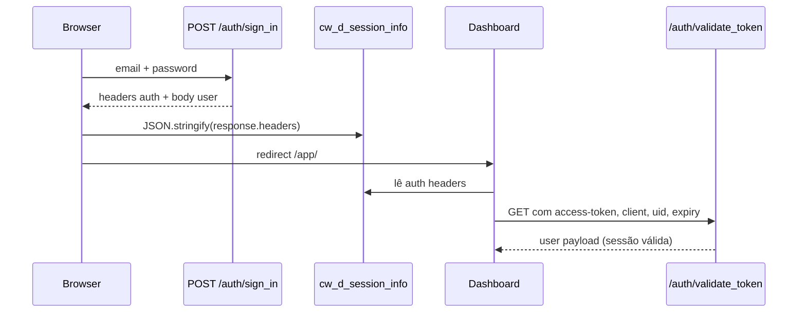

# Cookie `cw_d_session_info` — Login e Estrutura

O cookie `cw_d_session_info` é o mecanismo de sessão do dashboard do Chatwoot. Ele guarda os headers de autenticação do **devise-token-auth** para que o frontend consiga autenticar requisições subsequentes.

## Quando é registrado

O cookie é criado após autenticação bem-sucedida em estes fluxos:

| Fluxo | Endpoint | Função |
|-------|----------|--------|
| Login normal | `POST /auth/sign_in` | `setAuthCredentials(response)` |
| Confirmação de e-mail | `POST /auth/confirmation` | `setAuthCredentials(response)` |
| Reset de senha | `PUT /auth/password` | `setAuthCredentials(response)` |
| MFA | `POST /auth/sign_in` (com OTP) | gravação manual no `MfaVerification.vue` |

O fluxo principal de login:

```13:36:app/javascript/v3/api/auth.js
export const login = async ({
  ssoAccountId,
  ssoConversationId,
  ...credentials
}) => {
  try {
    const response = await wootAPI.post('auth/sign_in', credentials);
    // ...
    setAuthCredentials(response);
    clearLocalStorageOnLogout();
    window.location = getLoginRedirectURL({...});
```

## Como é gravado

A função central é `setAuthCredentials`:

```31:37:app/javascript/dashboard/store/utils/api.js
export const setAuthCredentials = response => {
  const expiryDate = getHeaderExpiry(response);
  Cookies.set('cw_d_session_info', JSON.stringify(response.headers), {
    expires: differenceInDays(expiryDate, new Date()),
  });
  setUser(response.data.data, expiryDate);
};
```

Detalhes importantes:

1. **Conteúdo**: `JSON.stringify(response.headers)` — serializa **todos** os headers da resposta Axios, não só os de auth.
2. **Expiração do cookie**: calculada a partir do header `expiry` (Unix timestamp).
3. **SameSite**: `Lax` (definido globalmente no `js-cookie`).
4. **Sem `HttpOnly`**: é um cookie legível pelo JavaScript no browser.

No backend, o login retorna os headers via **devise-token-auth** (gem `DeviseTokenAuth`). Configuração relevante:

```6:18:config/initializers/devise_token_auth.rb
  config.change_headers_on_each_request = false
  config.token_lifespan = 2.months
  config.max_number_of_devices = 25
```

Ou seja: o token **não rotaciona** a cada request e vale por **2 meses**.

## Estrutura do cookie

### Campos que realmente importam para autenticação

O frontend usa apenas estes 5 campos:

```10:23:app/javascript/dashboard/helper/APIHelper.js
  if (Auth.hasAuthCookie()) {
    const {
      'access-token': accessToken,
      'token-type': tokenType,
      client,
      expiry,
      uid,
    } = Auth.getAuthData();
    Object.assign(wootApi.defaults.headers.common, {
      'access-token': accessToken,
      'token-type': tokenType,
      client,
      expiry,
      uid,
    });
```

| Campo | Significado | Seu valor |
|-------|-------------|-----------|
| `access-token` | Hash do token de sessão | `mdvHdpSX0GPxIsVH6hB1zg` |
| `client` | ID do dispositivo/sessão | `JzpHRHrMA-rfBWFjdbrICA` |
| `uid` | E-mail do usuário (identificador) | `tecnicos@directcall.com.br` |
| `expiry` | Unix timestamp de expiração | `1789580729` (~set/2026) |
| `token-type` | Tipo do token | `Bearer` |

### Campos extras no seu cookie

O seu JSON tem muito mais do que o necessário porque o login normal grava `response.headers` inteiro. Os demais campos são headers HTTP da resposta e **não são usados** para auth:

- `authorization` — header composto do devise-token-auth (Base64 do mesmo JSON de auth). O Chatwoot **não usa** esse campo; envia os headers individuais.
- `cache-control`, `content-type`, `content-length`, `etag` — metadados da resposta.
- `x-frame-options`, `x-xss-protection`, etc. — headers de segurança do Rails.
- `x-platform: fazer.ai` — header customizado da sua instalação (não é padrão do Chatwoot OSS).

O campo `authorization` que você tem decodifica para:

```json
{
  "access-token": "mdvHdpSX0GPxIsVH6hB1zg",
  "token-type": "Bearer",
  "client": "JzpHRHrMA-rfBWFjdbrICA",
  "expiry": "1789580729",
  "uid": "tecnicos@directcall.com.br"
}
```

### Estrutura mínima (fluxo MFA)

No MFA, o cookie é gravado de forma mais enxuta — só os 5 campos de auth:

```75:84:app/javascript/dashboard/components/auth/MfaVerification.vue
      const authData = {
        'access-token': response.headers['access-token'],
        'token-type': response.headers['token-type'],
        client: response.headers.client,
        expiry: response.headers.expiry,
        uid: response.headers.uid,
      };

      document.cookie = `cw_d_session_info=${encodeURIComponent(JSON.stringify(authData))}; path=/; SameSite=Lax`;
```

## Ciclo de vida após o login



1. **Inicialização** (`dashboard.js`): `window.axios = createAxios(axios)` lê o cookie e injeta os headers em todas as requisições.
2. **Validação** (`auth.js` store): `validityCheck()` chama `GET /auth/validate_token`; se retornar 401, o cookie é removido.
3. **Logout**: `Cookies.remove('cw_d_session_info')` + redirect.

## Resumo

O cookie que você tem está **correto e funcional**. A estrutura mínima necessária seria:

```json
{
  "access-token": "mdvHdpSX0GPxIsVH6hB1zg",
  "token-type": "Bearer",
  "client": "JzpHRHrMA-rfBWFjdbrICA",
  "expiry": "1789580729",
  "uid": "tecnicos@directcall.com.br"
}
```

Os campos extras (`content-type`, `x-platform`, etc.) vêm do fato de o login normal persistir o objeto `response.headers` completo do Axios — é comportamento esperado, embora não seja o ideal do ponto de vista de segurança/limpeza.
